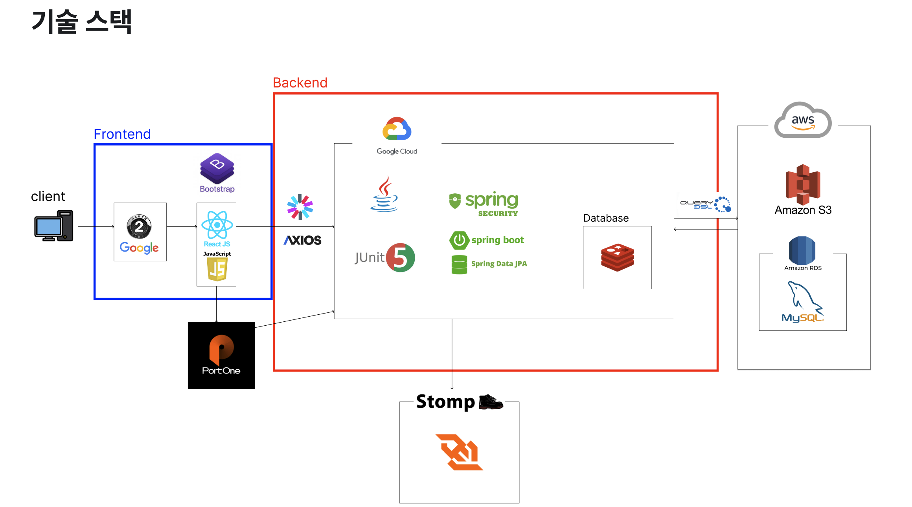
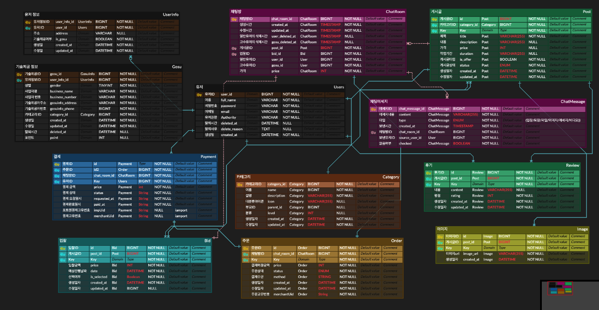
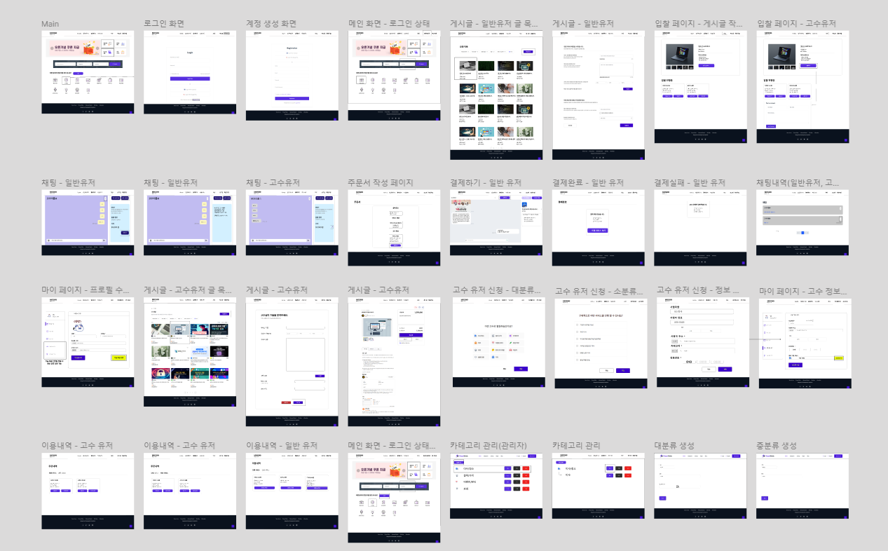

# mosoo-backend_README

## 프로젝트 소개


안녕하세요! 모수 프로젝트에 관심을 가져주셔서 감사합니다. 🙇‍🙌

Mosoo는 숨고와 같은 재능 마켓 플랫폼을 모티브로한 플랫폼 입니다.

사용자는 다양한 서비스를 탐색하고 요청할 수 있고 기술 제공자는 서비스를 제공할 수 있습니다.

회원가입 및 로그인(구글 로그인 포함)을 통해 결제도 완료할 수 있으며 지역기반, 카테고리 별로 서비스 제공 및 공유하여 사용자의 편의성을 향상시켰습니다.

## 팀원 소개

- `멤버` : 차현승
- `게시글, 후기, 입찰` : 박진영
- `이용내역, 결제` : 김다애
- `지역, 카테고리` : 홍민영
- `채팅` : 안창민

## 개발 기간

2024.11.18 ~ 2024.12.13 (1개월)

## 기술 스택



### Back-end

- Java 17 : 최신 LTS(Long-Term Support) 버전으로 안정성과 성능 제공
- Spring Boot 3.3.5 : 경량화된 자바 프레임워크, RESTful API 구축 및 서버 사이드 로직 처리하는 역할을 수행하고 이번 프로젝트 표준 기술로 채택
- Spring Security 3.3.5 : Spring Boot를 사용하여 개발하는 과정에 높은 연동성을 제공하고 인증, 권한 부여와 엑세스 제어등의 여러 기능을 편리하게 이용하여 사용자 데이터를 안전하게 보호
- JWT 0.12.3: 무상태성(State-Less)를 지향하는 HTTP의 특성에 적합하고 로그인 정보가 필요한 부분의 확장을 용이하게하는 장점을 이용하고자 선택
- JPA 3.3.5: 개발 과정에서 여러 데이터베이스 사용하고 연동하기 위한 ORM 기술을 사용해 객체지향 언어를 사용한 Spring Boot 프로젝트에 적합하고 MyBatis와 같은 SQL Mapping 기술보다 단순한 DB조작을 많이 하는 서비스를 구현하는 이번 프로젝트에 적합
- MySQL(AWS RDS): 관계형 데이터베이스, 서비스 관련 데이터를 저장 및 관리
- AWS S3 2.2.6: 이미지 파일 업로드
- Redis: 모든 데이터를 메모리에 저장하고 조회하는 In-Memory DB 모든 데이터를 메모리로 불러와서 처리하는 메모리 기반의 key-value 구조의 데이터 관리 시스템(DBMS)

### Front-end

- HTML, CSS : 웹 표준을 준수한 마크업 및 스타일링
- React : 컴포넌트 기반의 UI 라이브러리를 활용하여 효율적인 상태 관리 및 인터랙티브한 사용자 인터페이스 구현
- Axios: 백엔드와의 HTTP 통신을 위한 비동기 요청 처리 라이브러리

### 서비스 배포 환경

- 프론트엔드 배포
    - Nginx, Docker-compose
- 백엔드 배포
    - GCP VM
        - GNU/Linux 5.15.0-91-generic
        - Ubuntu 22.04.5 LTS
    - Docker-compose
- CI/CD : Gitlab CI/CD

### CI/CD 흐름도


### 버전 및 이슈관리

GitLab Project, GitLab Issues, Docker Hub(배포용)

### 협업 툴

Discord, Notion

### 기타

- Mapstruct 1.5.3
- Lombok 1.18.34
- Swagger 2.0.4


## 브랜치 전략


- Git-flow 전략을 기반으로 master, develop 브랜치와 featue 등의 기능 브랜치를 활용했습니다.
    - master : 배포 단계에서만 사용하는 브랜치입니다.
    - develop : 개발 단계에서의 master 역할을 하는 브랜치입니다.
    - review: 기능 브랜치를 develop에 merge하기 전 팀원들 간 코드 리뷰를 통해 정상적으로 동작을 하는지 확인하는 역할을 하는 브랜치입니다.
    - feature: 기능 단위로 독립적인 개발 환경을 위해 사용하고 merge 후 브랜치를 삭제해주었습니다.
    - refactor: 기존 코드를 개선하고 구조를 변경하는 브랜치입니다. review-develop으로 merge 후 브랜치를 삭제해 주었습니다.


## 주요 기능


**00 유저 역할**

- 모여라 고수는 전문가와 고개매칭 서비스 입니다. 고수, 유저, 관리자의 역할로 나뉘어 각자 원하는 글과 고객 혹은 고수를 찾을 수 있습니다.

**01 로그인**

- 일반 로그인과 구글 로그인은 공통으로 발급받은 JWT 토큰을 이용하여 인증을 통해 로그인을 진행합니다.

**02 카테고리**

- 카테고리는 총 세 단계의 분류를 거치며, 단계별로 세부적으로 선택할 수 있습니다.

**03 게시글, 입찰, 후기**

- 일반 유저가 고수 요청 게시글을 작성할 경우 고수가 해당 게시글에 지원하고, 게시글 작성자가 입찰하는 방식입니다.

**04 관리자**

- 관리자는 유저와 카테고리, 게시글을 관리할 수 있으며 상세한 내용을 확인할 수 있습니다.

**05 채팅**

- 파일, 이미지, 동영상, 메세지 등의 채팅을 통해 날짜와 금액을 상의하고 유저는 결제로 넘어갈 수 있습니다.

**06 결제**

- 주문서를 토대로 결제를 진행할 수 있습니다. 결제는 카카오페이 테스트 결제를 통해 진행되며, 검증과정을 통해 결제가 완료 됩니다.

## ERD




## 와이어프레임




## 프로젝트 구조 

<details>
<summary>프로젝트 구조</summary>
<div markdown="1">       


---


  ```bash
  
  # bid : 입찰
  # category : 카테고리
  # chatting : 채팅
  # common.entity : 상품 카테고리
  # config : 상품 쿠폰
  # exception : 전역 예외
  # jwt : 회원
  # oath : 인증
  # order : 주문
  # payment : 상품
  # post
  # review
  # user
  # utils.s3bucket
  
  src
  ├── main
  │   └── java
  │       └── com
  │           └── team2
  │               └── fitinside
  │                   ├── bid
  │                   │   ├── controller
  │                   │   ├── dto
  │                   │   ├── entity
  │                   │   ├── mapper
  │                   │   ├── repository
  │                   │   └── service
  │                   ├── category
  │                   │   ├── controller
  │                   │   ├── dto
  │                   │   ├── entity
  │                   │   ├── mapper
  │                   │   ├── repository
  │                   │   └── service
  │                   ├── chatting
  │                   │   ├── controller
  │                   │   ├── dto
  │                   │   ├── entity
  │                   │   ├── mapper
  │                   │   ├── repository
  │                   │   └── service
  │                   ├── common
  │                   │   ├── entity
  │                   ├── config
  │                   │   ├── jwt
  │                   │   ├── swagger
  │                   ├── exception
  │                   ├── jwt
  │                   ├── member
  │                   │   ├── controller
  │                   │   ├── dto
  │                   │   ├── entity
  │                   │   ├── mapper
  │                   │   ├── repository
  │                   │   └── service
  │                   ├── oath
  │                   │   ├── controller
  │                   │   ├── dto
  │                   │   ├── entity
  │                   │   ├── repository
  │                   │   ├── service
  │                   │   └── util
  │                   ├── order
  │                   │   ├── controller
  │                   │   ├── dto
  │                   │   ├── entity
  │                   │   ├── mapper
  │                   │   ├── repository
  │                   │   └── service
  │                   └── payment
  │                   │   ├── config
  │                   │   ├── controller
  │                   │   ├── dto
  │                   │   ├── entity
  │                   │   ├── mapper
  │                   │   ├── repository
  │                   │   └── service
  │                   └── post
  │                   │   ├── controller
  │                   │   ├── dto
  │                   │   ├── entity
  │                   │   ├── mapper
  │                   │   ├── repository
  │                   │   └── service
  │                   └── review
  │                   │   ├── controller
  │                   │   ├── dto
  │                   │   ├── entity
  │                   │   ├── mapper
  │                   │   ├── repository
  │                   │   └── service
  │                   └── user
  │                   │   ├── controller
  │                   │   ├── dto
  │                   │   ├── entity
  │                   │   ├── mapper
  │                   │   ├── repository
  │                   │   └── service
  │                   └── utils
  │                       └── s3bucket
  │                           ├── controller
  │                           └── service
  └── test
      └── java
          └── com
              └── team2
                  └── mosoo_backend
                      ├── category.service
                      │   └── CategoryServiceTest
                      ├── chatting
                      │   ├── controller
                          │   │   └── ChatMessageController
                          │   │   └── ChatRoomControllerTest
                      └── ├──repository
                                          │   │   └── ChatMessageQueryRepositoryTest
                                        │   │   └── ChatMessageRepositoryTest
                                        └── ├──service
                                          │   │   └── ChatMessageServiceTest
                                        │   │   └── ChatRoomServiceTest
                                        └── ├──MosooBackendApplicationTests
  
                   
  
  ```


</div>
</details>
